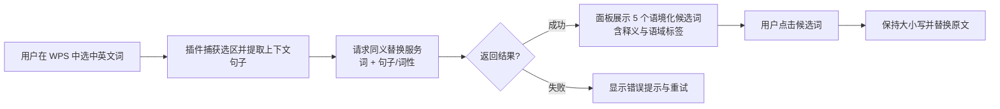

# WPS-Paraphrasing 需求文档

| 项目 | 内容 |
| --- | --- |
| 产品名称 | WPS-Paraphrasing（WPS 同义替换插件） |
| 文档版本 | v0.1（初稿） |
| 更新日期 | 2026-08-28 |
| 状态 | 待评审 |

## 1. 背景与目标

### 1.1 背景

用户在 WPS 中进行英文写作时，常遇到两个问题：

- 词汇重复：同一表达反复出现，文章显得单调。
- 措辞不地道：直接查同义词典得到的替换词往往不符合语境、搭配或语域，读起来生硬。

### 1.2 产品目标

为 WPS 用户提供**语境感知的同义替换**能力：选中一个英文词语，即可获得五个结合上下文、表达地道且适用于当前语境的同义/近义候选词，并支持一键替换。

### 1.3 成功指标（建议）

- 选中词语到候选词展示的端到端响应时间 ≤ 1.5 秒（网络正常时）。
- 用户点击替换率（展示候选后被采纳的比例）作为推荐质量的核心指标。
- 替换后撤销率（替换后立刻 Ctrl+Z）作为负面质量信号。

## 2. 用户与场景

### 2.1 目标用户

- 需要撰写英文论文、报告、邮件的职场人士与学生。
- 英文水平中等、希望提升措辞地道度的写作者。

### 2.2 典型场景

**场景 A：论文润色**
用户写论文时发现反复使用 "important"，选中该词，插件给出 "crucial / essential / pivotal / vital / significant" 等候选，并按当前句子的语境排序，用户一键替换。

**场景 B：语域匹配**
用户在写正式商务邮件，选中 "get"，插件优先给出 "obtain / receive" 等正式用语，而非口语化的 "grab"。

**场景 C：搭配纠偏**
用户选中某词后，插件识别该词在句中的词性（如名词/动词），只推荐同词性且搭配合理的候选（例如 "run a company" 语境下推荐 "operate / manage"，而非 "jog"）。

## 3. 功能需求

### 3.1 功能列表

| 编号 | 功能 | 优先级 | 说明 |
| --- | --- | --- | --- |
| F1 | 选词唤起候选面板 | P0 | 在 WPS 文档中选中一个英文词（单词或短语）后，通过面板/悬浮入口展示候选词 |
| F2 | 同义候选生成 | P0 | 为选中的词生成恰好 5 个同义或近义的英文候选词 |
| F3 | 语境匹配排序 | P0 | 候选词结合选词所在句子（建议扩展至前后各 1–2 句）进行语境打分与排序，保证推荐贴合语境、地道 |
| F4 | 一键替换 | P0 | 点击候选词将文档中的选中词替换为该词 |
| F5 | 大小写保持 | P1 | 替换时自动匹配原词的大小写形式（首字母大写、全大写、全小写） |
| F6 | 候选词释义与语境说明 | P1 | 悬停或展开查看每个候选词的简要释义、语域标签（正式/中性/口语）与语境适配说明 |
| F7 | 词性识别 | P1 | 识别选中词在当前句中的词性，只推荐同词性候选 |
| F8 | 加载与错误状态 | P0 | 候选加载中显示 loading；服务失败或无候选时给出可理解的错误提示与重试入口 |
| F9 | 撤销友好 | P1 | 替换操作与 WPS 原生撤销（Ctrl+Z）兼容，单次替换可一步撤销 |
| F10 | 离线/降级模式 | P2 | 网络不可用时，基于本地基础词库提供未做语境排序的候选词，并明确提示"离线模式" |

### 3.2 核心交互流程



### 3.3 功能细节

#### 3.3.1 选词与上下文提取（F1）

- 选中内容为英文单词或连续短语（建议支持 1–3 个词）。
- 未选中或选中为非英文内容时，面板提示引导文案。
- 随选词一并提取所在完整句子，作为语境输入。

#### 3.3.2 候选词生成与语境排序（F2/F3）

- 每次返回**恰好 5 个**候选词；候选不足时可少于 5 个并提示。
- 候选词要求：
  - 与原词语义相同或相近（同义/近义）；
  - 与原词在句中词性一致；
  - 符合当前语境与搭配，语域不冲突（如正式文体不推荐口语词）；
  - 排除原词本身及其简单变体（如复数、时态形式）。
- 排序依据语境适配度从高到低。

#### 3.3.3 替换（F4/F5/F9）

- 替换范围为用户选中的词，不改变句子其他部分。
- 大小写规则：
  - 原词全小写 → 候选词默认形式；
  - 原词首字母大写 → 候选词首字母大写；
  - 原词全大写 → 候选词全大写。
- 替换需兼容 WPS 撤销栈，用户可通过 Ctrl+Z 一步撤销。

#### 3.3.4 释义与语域标签（F6）

- 每个候选词提供：简要中文释义（或英英释义，视设置而定）、语域标签（正式/中性/口语）。
- 提供一句说明该词为何适配当前语境（增强可信度，允许由服务端生成）。

## 4. 非功能需求

| 编号 | 类别 | 需求 |
| --- | --- | --- |
| N1 | 性能 | 候选返回端到端 ≤ 1.5s（P95）；面板 UI 响应 ≤ 100ms |
| N2 | 兼容性 | 支持 Windows 端 WPS 文字（Writer）；后续评估 Mac 端与 WPS 网页版 |
| N3 | 安全 | 文档上下文仅用于生成候选词，不得存储原文；传输走 HTTPS |
| N4 | 隐私 | 遵循最小化采集原则，仅上传选词、所在句子（可选上下文）与匿名标识 |
| N5 | 可用性 | 服务端可用性 ≥ 99.5%；失败时有降级与重试机制 |
| N6 | 可维护性 | 候选生成与排序逻辑独立成服务，词库与模型可独立更新 |

## 5. 数据与接口（草案）

### 5.1 同义替换接口（草案）

**请求：**

```json
{
  "word": "important",
  "sentence": "This finding is important for our understanding of the disease.",
  "context": "可选：前后各 1-2 句",
  "pos": "auto",
  "count": 5
}
```

**响应（成功）：**

```json
{
  "candidates": [
    {
      "word": "crucial",
      "gloss": "极其重要的，决定性的",
      "register": "formal",
      "reason": "与原句学术语域一致，常用于描述研究结论的关键性"
    }
  ]
}
```

## 6. 验收标准（P0 功能）

1. 在 WPS 中选中英文单词后，可通过插件入口唤起候选面板。
2. 面板展示 5 个同义/近义英文候选词（候选不足时如实展示并提示）。
3. 候选词排序体现语境差异：同一词在不同句子中给出的推荐顺序可不同（提供用例验证）。
4. 点击候选词后，原词被替换为该词，且句子其余部分不变。
5. 替换后 Ctrl+Z 可一步撤销。
6. 原词首字母大写/全大写时，替换词大小写形式保持一致。
7. 服务异常时，面板显示明确错误信息并可重试，不崩溃、不卡死 WPS。

## 7. 后续规划（Out of Scope for v1）

- 批量替换（全文查找重复词并逐个替换）。
- 替换历史与"恢复原词"列表。
- 中文写作同义替换支持。
- 用户偏好学习（如偏好正式语域）。
- 短语级改写（paraphrase 整句）。
