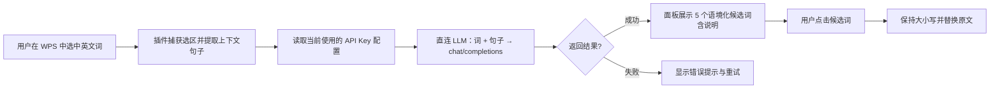

# WPS-Paraphrasing 需求文档

| 项目 | 内容 |
| --- | --- |
| 产品名称 | WPS-Paraphrasing（WPS 同义替换插件） |
| 文档版本 | v0.2 |
| 更新日期 | 2026-08-28 |
| 状态 | 开发中（dev 分支） |
| 产品定位 | **个人自用工具**，无商业化计划 |

## 1. 背景与目标

### 1.1 背景

用户在 WPS 中进行英文写作时，常遇到两个问题：

- 词汇重复：同一表达反复出现，文章显得单调。
- 措辞不地道：直接查同义词典得到的替换词往往不符合语境、搭配或语域，读起来生硬。

### 1.2 产品目标

提供**语境感知的同义替换**能力：选中一个英文词语，即可获得五个结合上下文、表达地道且适用于当前语境的同义/近义候选词，并支持一键替换。

### 1.3 成功指标（建议）

- 选中词语到候选词展示的端到端响应时间 ≤ 1.5 秒（网络正常时）。
- 候选词质量以实际使用体验为准（个人使用，不建数据埋点）。

## 2. 用户与场景

### 2.1 目标用户

**仅开发者本人使用**，无需考虑多用户、权限、计费等场景。

### 2.2 典型场景

**场景 A：论文润色**
用户写论文时发现反复使用 "important"，选中该词，插件给出 "crucial / essential / pivotal / vital / significant" 等候选，并按当前句子的语境排序，用户一键替换。

**场景 B：语域匹配**
用户在写正式商务邮件，选中 "get"，插件优先给出 "obtain / receive" 等正式用语，而非口语化的 "grab"。

**场景 C：搭配纠偏**
用户选中某词后，插件识别该词在句中的词性（如名词/动词），只推荐同词性且搭配合理的候选（例如 "run a company" 语境下推荐 "operate / manage"，而非 "jog"）。

## 3. 技术架构约束

- **直连大模型**：候选词由大模型实时生成，插件前端直接调用 LLM API，**不建数据库、不建自有后端**。
- **协议**：采用 OpenAI 兼容协议（`POST {baseUrl}/chat/completions`），可接入 DeepSeek、OpenAI 或任意兼容服务商；默认 DeepSeek（`https://api.deepseek.com/v1`，`deepseek-chat`）。
- **多套 Key 配置**：支持配置多个 API Key（各自命名，可含不同服务商/模型），在设置页切换当前使用的一套。
- **凭据存储**：API Key 仅存于本机 WPS WebView 的 localStorage，不上传、不入库。个人自用场景下可接受此方案。
- **分支策略**：日常开发在 `dev` 分支进行，远端仅保留 `dev`。

## 4. 功能需求

### 4.1 功能列表

| 编号 | 功能 | 优先级 | 说明 |
| --- | --- | --- | --- |
| F1 | 选词唤起候选面板 | P0 | 在 WPS 文档中选中一个英文词（单词或短语）后，通过面板/悬浮入口展示候选词 |
| F2 | 同义候选生成 | P0 | 为选中的词生成恰好 5 个同义或近义的英文候选词（由 LLM 实时生成） |
| F3 | 语境匹配排序 | P0 | 将选词所在完整句子随请求发给 LLM，要求其按语境适配度排序，保证推荐贴合语境、地道 |
| F4 | 一键替换 | P0 | 点击候选词将文档中的选中词替换为该词 |
| F5 | 大小写保持 | P1 | 替换时自动匹配原词的大小写形式（首字母大写、全大写、全小写） |
| F6 | 候选词语境说明 | P1 | 每个候选词附 1 句简短说明（为何适配当前语境），由 LLM 一并返回 |
| F7 | 词性识别 | P1 | 在提示词中要求 LLM 识别原词在句中的词性，只推荐同词性候选 |
| F8 | 加载与错误状态 | P0 | 候选加载中显示 loading；LLM 请求失败或返回异常时给出可理解的错误提示与重试入口 |
| F9 | 撤销友好 | P1 | 替换操作与 WPS 原生撤销（Ctrl+Z）兼容，单次替换可一步撤销 |
| F10 | 多套 API Key 配置 | P0 | 设置页支持新增/编辑/删除多套命名配置（名称 + API Key + Base URL + 模型），可随时切换当前使用的一套 |
| F11 | 配置状态展示 | P1 | 主面板显示当前使用的配置名称；未配置时引导进入设置页 |

### 4.2 核心交互流程



### 4.3 功能细节

#### 4.3.1 选词与上下文提取（F1）

- 选中内容为英文单词或连续短语（建议支持 1–3 个词）。
- 未选中或选中为非英文内容时，面板提示引导文案。
- 随选词一并提取所在完整句子，作为语境输入。

#### 4.3.2 候选词生成与语境排序（F2/F3）

- 每次返回**恰好 5 个**候选词；LLM 返回不足时如实展示。
- 提示词要求：
  - 与原词语义相同或相近（同义/近义）；
  - 与原词在句中词性一致；
  - 符合当前语境与搭配，语域不冲突（如正式文体不推荐口语词）；
  - 排除原词本身及其简单变体（如复数、时态形式）；
  - 按语境适配度从高到低排序；
  - 以 JSON 数组格式输出（含 word 与 reason 字段），便于解析。

#### 4.3.3 替换（F4/F5/F9）

- 替换范围为用户选中的词，不改变句子其他部分。
- 大小写规则：
  - 原词全小写 → 候选词默认形式；
  - 原词首字母大写 → 候选词首字母大写；
  - 原词全大写 → 候选词全大写。
- 替换需兼容 WPS 撤销栈，用户可通过 Ctrl+Z 一步撤销。

#### 4.3.4 设置页（F10/F11）

- 支持配置多套 API Key，每套包含：
  - **名称**：用户自定义（如 "DeepSeek 主号"），长度 ≤ 30 字符；
  - **API Key**：必填；
  - **Base URL**：留空使用默认值（DeepSeek）；
  - **模型**：留空使用默认值（deepseek-chat）。
- 列表页展示所有配置：名称、模型、打码后的 Key，当前使用的配置带"使用中"标记。
- 操作：新增、编辑、删除（需确认）、一键切换当前配置。
- 删除当前使用的配置时，自动切换到剩余的第一套（如有）。
- 至少配置一套后，主面板才允许发起候选词请求；未配置时请求按钮给出引导提示。

## 5. 非功能需求

| 编号 | 类别 | 需求 |
| --- | --- | --- |
| N1 | 性能 | 候选返回端到端 ≤ 1.5s（P95，取决于 LLM 服务）；面板 UI 响应 ≤ 100ms |
| N2 | 兼容性 | 支持 Windows 端 WPS 文字（Writer）现代版本（Chromium 内核 WebView） |
| N3 | 安全 | API Key 仅存本机 localStorage；文档上下文仅随单次请求发给所选 LLM 服务商，不做任何持久化 |
| N4 | 隐私 | 个人自用，无埋点、无遥测；仅上传选词与所在句子 |
| N5 | 容错 | LLM 请求失败/超时/返回非 JSON 时有明确错误提示与重试，不崩溃、不卡死 WPS |
| N6 | 可维护性 | LLM 客户端独立封装，换服务商只改 baseUrl/model 配置，不改业务代码 |

## 6. LLM 请求格式（实现基线）

**请求**（OpenAI 兼容协议）：

```json
{
  "model": "deepseek-chat",
  "messages": [
    { "role": "system", "content": "<固定提示词：英文写作助手，输出 5 个语境化同义词的 JSON 数组>" },
    { "role": "user", "content": "选中的词：「important」\n所在句子：「This finding is important for our understanding of the disease.」" }
  ],
  "temperature": 0.3,
  "response_format": { "type": "json_object" }
}
```

**期望响应内容**（解析 `choices[0].message.content`）：

```json
[
  { "word": "crucial", "reason": "与原句学术语域一致，强调关键性" },
  { "word": "significant", "reason": "通用正式用语，适配研究语境" }
]
```

- 解析失败时兜底：用正则提取响应中的 JSON 数组再试一次。
- 输出按语境适配度排序，取前 5 个展示。

## 7. 验收标准（P0 功能）

1. 在 WPS 中选中英文单词后，可通过插件入口唤起候选面板。
2. 面板展示 5 个同义/近义英文候选词（LLM 返回不足时如实展示）。
3. 候选词排序体现语境差异：同一词在不同句子中给出的推荐顺序可不同。
4. 点击候选词后，原词被替换为该词，且句子其余部分不变。
5. 替换后 Ctrl+Z 可一步撤销。
6. 原词首字母大写/全大写时，替换词大小写形式保持一致。
7. 设置页可新增多套命名配置并切换使用中配置；主面板正确显示当前配置名。
8. 删除配置、留空必填项等操作有对应提示或确认，不出现静默失败。
9. LLM 请求异常时，面板显示明确错误信息并可重试，不崩溃、不卡死 WPS。

## 8. 后续规划（Out of Scope for v1）

- 批量替换（全文查找重复词并逐个替换）。
- 替换历史与"恢复原词"列表。
- 中文写作同义替换支持。
- 短语级改写（paraphrase 整句）。
- 流式输出（SSE）以缩短首词等待时间。
